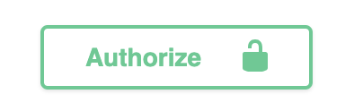
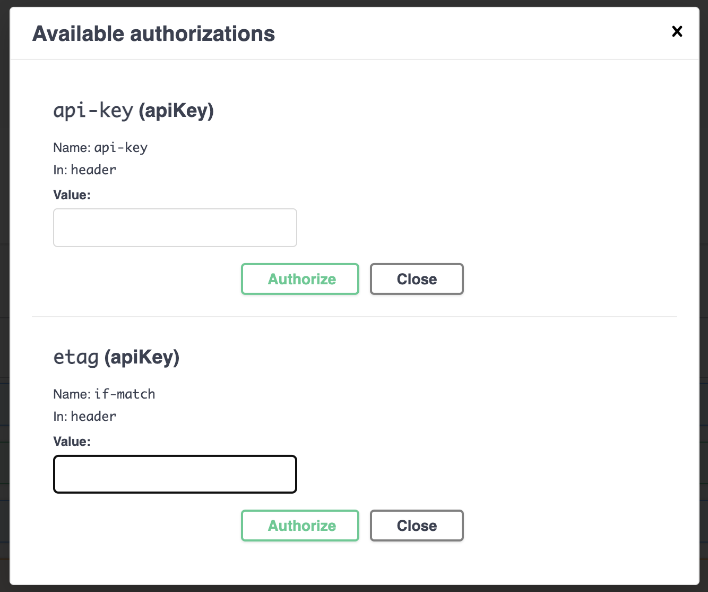

1. Installer les dépendances avec la commande `npm install`
2. Lancer le serveur avec la commande `npm run start:dev`
3. Ouvrir le navigateur à l'adresse `http://localhost:8000/api/docs`
4. Click sur le button `Authorize`
    - 
5. Le primer champ c'est pour la api-key, le duexième c'est pour le etag quand on veut update un entity:
    - 